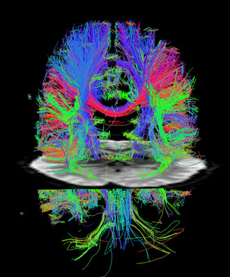
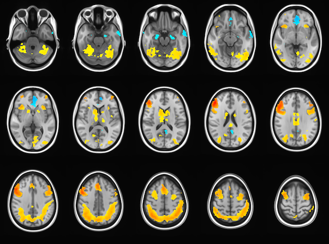

[ 1 ]

Neuroscience
==========

### About

>In recent years, with the advancements in computation power and data storage, the use of statistical learning has been able to dramatically increase and spread across industries. One specific field benefiting from this method of data analysis is neuroscience. This repository showcases my work in the field of neuroscience.

 

#### Projects

&nbsp;&nbsp;&nbsp;&nbsp;&nbsp; **`p1`**     &nbsp;&nbsp; Analysis of Aging, Dementia, and Traumatic Brain Injury data

 

[ 2 ]

 

---
Citations:

[ 1 ] - Washington University, _An fMRI cross sectional image of the brain bisects the diffusion image_. Image shows major nerve cell axons in the white matter of a resting brain.

[ 2 ] - Brigham Young University - MRI Research Facility, _fMRI brain scan image_.

If you run into any issues or simply have a question, please feel free to contact me at jeremy.grace@outlook.com.
